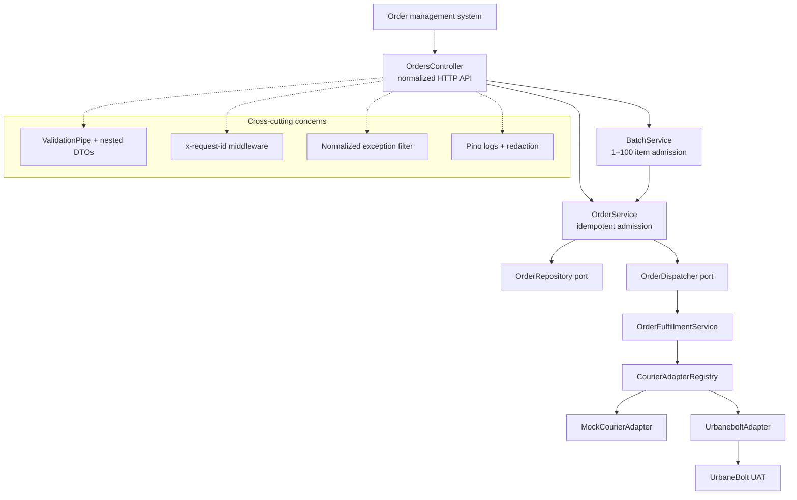
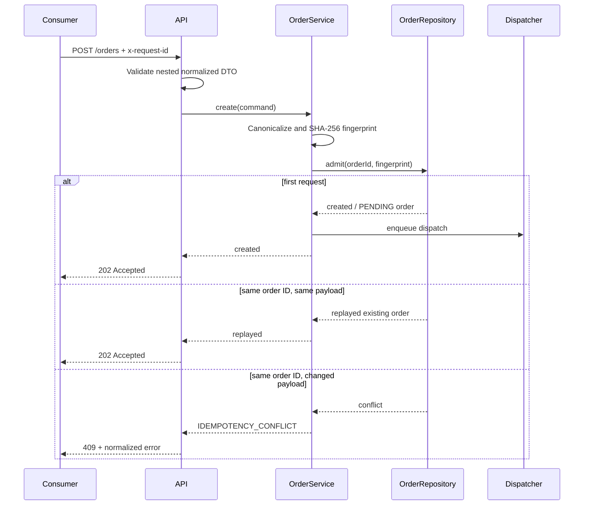
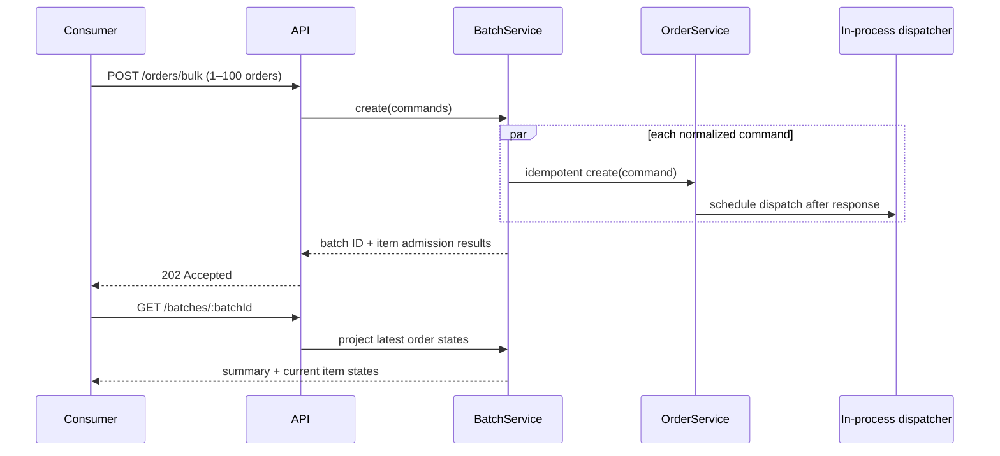

# Design: Multi-Courier Integration Platform

## Executive summary

The system exposes one internal shipment API and treats each courier as a replaceable integration plugin. The public contract is normalized around an internal order ID, shipper/consignee addresses, parcel dimensions, invoice data, and a courier-partner identifier. UrbaneBolt is the first real boundary; MockCourier proves the same contract works without a live provider.

The central design decision is to make provider behavior an edge concern. Controllers, API DTOs, idempotency, lifecycle rules, and consumers work entirely with normalized types. Courier-specific authentication, request mapping, response parsing, and status translation are isolated in adapters.

## Goals and non-goals

| Goals                                      | Non-goals in the current reference implementation          |
| ------------------------------------------ | ---------------------------------------------------------- |
| One stable API for all courier partners    | A customer-facing UI                                       |
| New providers without route or DTO changes | A provider-specific API exposed to clients                 |
| Deterministic local development and CI     | Real UrbaneBolt credentials in source control or CI        |
| Safe API admission and consistent errors   | Pretending that in-memory state is durable storage         |
| A path to production-grade async dispatch  | Hiding the remaining database, worker, and durability work |

The [assignment coverage matrix](docs/ASSIGNMENT-COVERAGE.md) is the source of truth for implementation completeness.

## Architecture



### Responsibility map

| Component                     | Owns                                                                       | Must not own                                         |
| ----------------------------- | -------------------------------------------------------------------------- | ---------------------------------------------------- |
| OrdersController              | HTTP status, parameter extraction, normalized request/response translation | Provider payloads or provider-specific error parsing |
| OrderService                  | Idempotent order admission and dispatch scheduling                         | Courier API calls                                    |
| OrderRepository               | Admission uniqueness and state persistence                                 | HTTP or provider mapping                             |
| BatchService                  | Batch summary, item-level admission outcomes, state projection             | Provider calls or a second order-validation contract |
| OrderFulfillmentService       | Lifecycle orchestration: dispatch, track, cancel                           | Provider credential management                       |
| CourierAdapterRegistry        | Selecting a configured adapter by partner                                  | Route selection or request validation                |
| CourierAdapter implementation | Auth, provider mapping, bounded HTTP calls, status normalization           | Public API DTOs or another provider's logic          |

## Why the Adapter pattern

Courier APIs differ in auth mechanisms, field names, cancel identifiers, error bodies, and status vocabularies. A conditional branch in the controller would couple every consumer change to every courier addition. The Adapter pattern gives each provider a narrow, testable implementation of the same port:

```ts
interface CourierAdapter {
  readonly partner: CourierPartner;
  create(order: StoredOrder): Promise<CourierDispatchResult>;
  track(order: StoredOrder): Promise<CourierTrackingResult>;
  cancel(order: StoredOrder): Promise<CourierCancelResult>;
}
```

The existing **MockCourierAdapter** and **UrbaneboltAdapter** implement the same three methods. A future Delhivery, Shiprocket, Bluedart, or DTDC adapter is additive. Existing routes, DTOs, lifecycle orchestration, and adapters remain closed to modification.

## Request lifecycle

### Admission and idempotency



The fingerprint canonicalizes object keys and omits undefined optional values before hashing. The same logical request therefore produces the same value even when JSON field order changes. The order ID is the natural client idempotency key; reusing it with a materially different payload is rejected rather than silently creating a second shipment.

### Provider lifecycle

The fulfilment service selects the adapter from the stored order's courier partner. Dispatch transitions PENDING to PROCESSING, calls the adapter, then persists the normalized provider shipment ID, AWB, and status. Tracking asks the same adapter for current state. Cancellation rejects delivered orders and is idempotent for already-cancelled ones.

In the current reference implementation, the dispatcher schedules the lifecycle call after the HTTP request is admitted. It is intentionally in-process: it keeps courier latency out of the request path and logs a failure without producing an unhandled rejection. The repository and batch state are also in-memory. The lifecycle service and ports are implemented and tested, but restart-safe dispatch is a planned production slice rather than a completed claim.

### Batch admission and state projection



The batch endpoint intentionally returns admission state, not a fictional synchronous courier result. A same-ID/different-payload collision becomes an item-level `IDEMPOTENCY_CONFLICT`; unaffected orders remain visible. The local map retains the batch only for the lifetime of the process. In the durable mode, the same response contract is backed by batch, item, order, and outbox records in one transaction.

## Data model

### Current local implementation

The process-local repository stores:

- internal UUID and external order ID;
- selected courier partner, service type, and payment mode;
- SHA-256 request fingerprint and original normalized command;
- normalized lifecycle state;
- provider shipment ID, AWB, failure code/message, and timestamps.

The batch service separately holds a batch UUID and its item-level admission outcome, then projects current order state on lookup. This is sufficient to demonstrate partial-result semantics and deterministic local behavior. Neither the orders nor batches survive a restart or coordinate across replicas.

### Production target

The production repository should use PostgreSQL with the following tables:

| Table            | Key fields and indexes                                           | Purpose                                                       |
| ---------------- | ---------------------------------------------------------------- | ------------------------------------------------------------- |
| orders           | unique order_id; request_fingerprint; partner/status index       | Canonical order state and idempotent admission.               |
| courier_attempts | order_id, operation, created_at; sanitized request/response JSON | Provider audit trail, errors, and reconciliation evidence.    |
| tracking_events  | unique order_id plus payload fingerprint; chronological index    | Append-only provider observations.                            |
| batches          | batch_id and summary counters                                    | Asynchronous bulk-work admission and status.                  |
| batch_items      | unique batch_id plus order_id                                    | Per-order progress, normalized failures, and partial success. |
| outbox_events    | unpublished-event index and deterministic aggregate key          | Reliable handoff from database transaction to worker queue.   |

The orders table owns the latest projection. Tracking events are append-only because the latest provider status alone is not enough to debug a disputed delivery.

## UrbaneBolt integration boundary

The adapter performs four provider interactions:

1. **POST /api/v1/auth/getToken/** to authenticate and cache the access token.
2. **POST /api/v1/services/manifest/** to create a shipment from the normalized order.
3. **GET /api/v1/services/tracking-pub/?awb=...** to retrieve shipment status.
4. **POST /api/v1/services/cancel/** to cancel by AWB.

It sends a bounded request with an AbortController timeout, never exposes raw provider bodies to the client, and maps values such as “In Transit” to the normalized **IN_TRANSIT** status. The contract test uses an injected fake fetch function to prove auth, URL, payload, status, and cancellation mappings without a live UAT account.

## Error, retry, and reconciliation strategy

The API emits a single error envelope with code, safe message, request ID, and optional field-level details. Validation failures and idempotency conflicts are distinct from provider failures. This keeps consumers independent of a courier's raw response wording.

For the production dispatcher, the intended strategy is:

| Failure class                             | Action                                                                                                      |
| ----------------------------------------- | ----------------------------------------------------------------------------------------------------------- |
| Consumer validation                       | Reject synchronously with 400 and actionable field details.                                                 |
| Unsupported or disabled courier           | Reject with a normalized client-facing code and configured partners.                                        |
| Courier 4xx                               | Persist sanitized attempt; do not retry blindly; return a normalized provider-validation or rejection code. |
| Timeout, network failure, or provider 5xx | Retry asynchronously with bounded exponential backoff and jitter. Persist final failure for reconciliation. |
| Authentication rejection                  | Invalidate cached token, re-authenticate once, retry the original operation once.                           |
| Timeout after ambiguous create            | Do not create a second shipment unless provider idempotency is proven. Mark for reconciliation by order ID. |

The current adapter provides timeout and safe provider error mapping. The local dispatcher logs a failed asynchronous dispatch and leaves the order marked `FAILED`; it intentionally does not retry. Durable retries, token-invalidating retry, attempt persistence, and reconciliation remain planned work and are not represented as complete.

## Security and operability

- **Input safety:** global validation transforms, whitelists, and rejects unknown properties; nested DTOs bound field length, type, numeric, phone, and country constraints.
- **Security headers:** Helmet is enabled before application routes.
- **CORS:** disabled by default rather than opened with a wildcard.
- **Correlation:** valid caller-provided **x-request-id** values are propagated; otherwise a UUID is created and returned.
- **Log redaction:** authorization, cookies, password, and API-key paths are censored in structured logs.
- **Secret handling:** UrbaneBolt credentials are environment-only and never appear in source, tests, or Postman examples.
- **Failure safety:** raw provider bodies and stack traces are kept out of client responses.

## Key trade-offs

| Decision                         | Benefit                                                   | Cost                                                        |
| -------------------------------- | --------------------------------------------------------- | ----------------------------------------------------------- |
| Normalized internal API          | Consumers and routes stay stable as providers change      | Adapter mapping work is required per provider.              |
| Order-ID fingerprint idempotency | Prevents accidental duplicate shipment admission          | Requires clear client ownership of order IDs.               |
| In-process async dispatcher      | Keeps HTTP admission fast and proves the handoff boundary | Loses work on crash; needs an outbox/worker for durability. |
| Process-local mock/default store | Fast, deterministic local review and CI                   | Not a substitute for a shared durable environment.          |
| No live UAT test in CI           | Reproducible tests without secrets or provider flakiness  | UAT smoke tests must be opt-in and separately recorded.     |

## Verification strategy

Unit and HTTP-contract tests are designed around observable behavior: create/replay/conflict, batch admission and partial outcomes, the 100-order limit, deferred dispatch, invalid payload rejection, error shape, mock lifecycle, and UrbaneBolt mapping. The CI workflow runs formatting, linting, compilation, coverage, and a container build on pushes and pull requests.

See [docs/VERIFICATION.md](docs/VERIFICATION.md) for the latest recorded command result and [docs/ASSIGNMENT-COVERAGE.md](docs/ASSIGNMENT-COVERAGE.md) for the implementation status of each assignment requirement.

## Production completion path

The clean next step is not to rewrite the controllers. It is to replace the existing process-local repository, batch map, and dispatcher with PostgreSQL records and an outbox-backed BullMQ worker. The public API and adapter contract remain stable while the system gains durability, retry, reconciliation, and restart-safe 100-order batch throughput.
