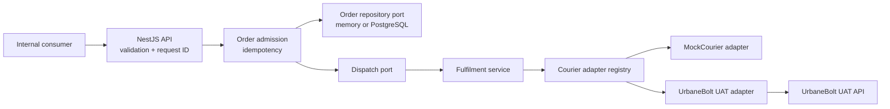

# Multi-Courier Integration Platform

[](https://github.com/shreyshreyansh/multi-courier-platform/actions/workflows/ci.yml)

An API-first logistics integration service that gives internal order systems one stable shipment contract while keeping courier-specific protocols behind isolated adapters.

This repository is a deliberate backend take-home submission. It demonstrates a validated normalized API, deterministic idempotency, asynchronous admission, a 1–100 order batch resource, a working mock courier, an UrbaneBolt UAT adapter boundary, safe error handling, and a testable extension model. It has two intentional operating modes: zero-dependency `memory` mode for fast review, and `postgres` mode for durable orders, sanitized courier attempts, and append-only tracking events.

## Reviewer links

| Read this                                                                        | Why it matters                                                                     |
| -------------------------------------------------------------------------------- | ---------------------------------------------------------------------------------- |
| [Design document](DESIGN.md)                                                     | Architecture, data model, reliability choices, trade-offs, and extension strategy. |
| [Assignment coverage](docs/ASSIGNMENT-COVERAGE.md)                               | Requirement-by-requirement evidence and the remaining implementation gaps.         |
| [Verification report](docs/VERIFICATION.md)                                      | Reproducible quality-gate results.                                                 |
| [Postman collection](postman/Multi%20Courier%20Platform.postman_collection.json) | A ready-to-import local API journey.                                               |

## The problem

An order-management system should not know whether an order is fulfilled by UrbaneBolt today or a different courier tomorrow. It should submit one normalized payload, get one error shape, and track one internal order identifier. Provider field names, token flows, status labels, and cancellation semantics belong at the integration edge.

This project makes that boundary explicit:



The controller and normalized order contract never import a provider-specific payload type. Adding a courier is a new adapter plus one registry registration; existing routes, DTOs, and business logic stay unchanged.

## What is implemented today

| Capability                                                                                 | Evidence                                                                                                                                      |
| ------------------------------------------------------------------------------------------ | --------------------------------------------------------------------------------------------------------------------------------------------- |
| Normalized create, track, cancel, batch-status, and health endpoints                       | [Orders controller](src/orders/api/orders.controller.ts), [Postman collection](postman/Multi%20Courier%20Platform.postman_collection.json)    |
| Strict nested request validation and rejection of unknown fields                           | [Create-order DTO](src/orders/api/create-order.dto.ts), [API tests](src/orders/orders.api.spec.ts)                                            |
| Idempotent admission by order ID and canonical SHA-256 request fingerprint                 | [Order service](src/orders/application/order.service.ts), [fingerprint utility](src/orders/domain/request-fingerprint.ts)                     |
| Courier-neutral port and registry                                                          | [Adapter contract](src/couriers/courier-adapter.ts), [registry](src/couriers/courier-adapter.registry.ts)                                     |
| Deterministic local MockCourier                                                            | [Mock adapter](src/couriers/mock-courier.adapter.ts)                                                                                          |
| UrbaneBolt UAT token, manifest, tracking, and cancellation mapping                         | [UrbaneBolt adapter](src/couriers/urbanebolt.adapter.ts), [contract test](src/couriers/urbanebolt.adapter.spec.ts)                            |
| Consistent JSON errors, correlation IDs, security headers, and redacted structured logs    | [HTTP setup](src/app.setup.ts), [error filter](src/common/all-exceptions.filter.ts)                                                           |
| Batch admission of 1–100 orders with partial-result visibility                             | [Batch service](src/orders/application/batch.service.ts), [HTTP tests](src/orders/orders.api.spec.ts)                                         |
| Durable PostgreSQL orders, idempotency, courier attempts, and tracking-event history       | [Prisma schema](prisma/schema.prisma), [PostgreSQL repository](src/orders/infrastructure/postgres-order.repository.ts)                        |
| Audited courier lifecycle with normalized, provider-safe tracking responses                | [Fulfilment service](src/orders/fulfillment/order-fulfillment.service.ts), [API test](src/orders/orders.api.spec.ts)                          |
| Bounded in-process retry after HTTP admission                                              | [Dispatcher](src/orders/fulfillment/in-process-order.dispatcher.ts), [unit tests](src/orders/fulfillment/in-process-order.dispatcher.spec.ts) |
| Reproducible PostgreSQL migration and API topology                                         | [Compose file](compose.yml), [Dockerfile](Dockerfile)                                                                                         |
| CI quality gate for formatting, linting, compilation, tests, coverage, and container build | [GitHub Actions workflow](.github/workflows/ci.yml)                                                                                           |

The [assignment coverage document](docs/ASSIGNMENT-COVERAGE.md) is intentionally candid about the remaining production work. PostgreSQL durability and bounded retry are implemented; a crash-safe outbox, durable batch state, and reconciliation worker are deliberately not claimed. The batch endpoint is implemented and tested, but its summary state remains process-local.

## Five-minute reviewer tour

1. Read the [design document](DESIGN.md) for the component boundaries and decisions.
2. Run the service in deterministic local mock mode, then run the Compose path to inspect durable mode.
3. Import the [Postman collection](postman/Multi%20Courier%20Platform.postman_collection.json).
4. Create, track, and cancel the supplied mock order.
5. Submit the supplied batch flow, then retrieve its batch-status resource.
6. Re-submit the same create request to see a safe replay; change any payload field with the same order ID to see the idempotency conflict.
7. Run the quality gate with **npm run verify**.

## Quick start

### Prerequisites

- Node.js 20.19 or newer
- npm 10 or newer
- Docker (optional, for the container build/run path)

### Run locally

```bash
git clone https://github.com/shreyshreyansh/multi-courier-platform.git
cd multi-courier-platform
npm ci
npm run start:dev
```

The default local configuration enables the deterministic **mock** courier without secrets. In a second terminal:

```bash
curl --silent http://localhost:3000/api/v1/health/live
```

Expected response:

```json
{
  "status": "ok",
  "service": "multi-courier-platform",
  "timestamp": "2026-08-14T05:17:22.709Z"
}
```

### Run the durable PostgreSQL deployment

The checked-in Compose topology starts PostgreSQL, waits for a health check, applies the Prisma migration as a one-shot job, then starts the API in `PERSISTENCE_MODE=postgres`.

```bash
docker compose up --build --detach
curl --fail --silent http://localhost:3000/api/v1/health/live
curl --request POST http://localhost:3000/api/v1/orders/bulk \
  --header 'Content-Type: application/json' \
  --data @examples/bulk-orders.json
```

Stop the stack when finished:

```bash
docker compose down
```

`docker compose down` preserves the named PostgreSQL volume. Add `--volumes` only when you intentionally want to remove the local review data.

### Submit a mock shipment

```bash
curl --request POST http://localhost:3000/api/v1/orders \
  --header 'Content-Type: application/json' \
  --header 'x-request-id: reviewer-create-1001' \
  --data '{
    "orderId": "ORDER-REVIEW-1001",
    "courierPartner": "mock",
    "serviceType": "FORWARD",
    "paymentMode": "PREPAID",
    "shipper": {
      "name": "Acme Warehouse",
      "phone": "+919900000001",
      "addressLine1": "1 Market Street",
      "city": "Bengaluru",
      "state": "Karnataka",
      "postalCode": "560001",
      "country": "IN"
    },
    "consignee": {
      "name": "Ada Lovelace",
      "phone": "+919900000002",
      "addressLine1": "42 Computing Lane",
      "city": "Mumbai",
      "state": "Maharashtra",
      "postalCode": "400001",
      "country": "IN"
    },
    "parcel": {
      "weightGrams": 750,
      "lengthCm": 20,
      "widthCm": 15,
      "heightCm": 10,
      "description": "Books"
    },
    "invoice": {
      "number": "INV-REVIEW-1001",
      "amount": 1299,
      "currency": "INR"
    }
  }'
```

The endpoint returns **202 Accepted** after admission. The response shows **PENDING** because no provider call is made in the request path. Immediately after the response is released, the dispatcher runs the courier workflow; with MockCourier, a subsequent tracking request normally reads **CREATED**. Transient dispatch failures are retried with a bounded exponential delay (three attempts by default), and durable mode records each attempt. The scheduler is still in-process: a crash between admission and dispatch requires the next, explicitly documented transactional-outbox slice.

### Track and cancel

```bash
curl http://localhost:3000/api/v1/orders/ORDER-REVIEW-1001/track

curl --request POST \
  http://localhost:3000/api/v1/orders/ORDER-REVIEW-1001/cancel
```

Use the same order ID and exactly the same create payload to receive a safe replay. Reusing an existing order ID with changed content returns **409 IDEMPOTENCY_CONFLICT**.

### Submit and inspect a batch

The batch endpoint validates the wrapper, accepts **1–100** normalized orders, admits them concurrently, and returns item-level results. An individual idempotency conflict does not hide the status of the other items.

```bash
curl --request POST http://localhost:3000/api/v1/orders/bulk \
  --header 'Content-Type: application/json' \
  --data @examples/bulk-orders.json

curl http://localhost:3000/api/v1/batches/<batchId>
```

The first response is **202 Accepted** and includes `batchId`, total, accepted, completed, and failed counts. Querying the status resource projects the latest in-process order states. In PostgreSQL mode, individual orders survive restart; the batch summary itself is intentionally not yet durable across a process restart.

## API contract

All routes are prefixed with **/api/v1**. The controller uses explicit Swagger annotations; the checked-in Postman collection is the executable API reference for this submission.

| Method | Route                       | Success | Purpose                                                                |
| ------ | --------------------------- | ------- | ---------------------------------------------------------------------- |
| GET    | **/health/live**            | 200     | Process liveness probe.                                                |
| POST   | **/orders**                 | 202     | Validate and idempotently admit one normalized shipment order.         |
| POST   | **/orders/bulk**            | 202     | Validate and admit 1–100 orders; preserve item-level partial outcomes. |
| GET    | **/batches/:batchId**       | 200     | Read a batch admission summary and latest item lifecycle states.       |
| GET    | **/orders/:orderId/track**  | 200     | Retrieve normalized provider tracking state and events.                |
| POST   | **/orders/:orderId/cancel** | 200     | Cancel an order when its lifecycle permits it.                         |

Every response carries an **x-request-id** header. Send a valid request ID yourself to preserve end-to-end correlation; otherwise the service creates one.

### Normalized error envelope

```json
{
  "error": {
    "code": "VALIDATION_ERROR",
    "message": "Request validation failed.",
    "requestId": "reviewer-create-1001",
    "details": [
      { "reason": "parcel.weightGrams: weightGrams must not be less than 1" }
    ]
  }
}
```

The service does not return raw UrbaneBolt responses to API clients. Provider failures are mapped to application-level error codes; the correlation ID is the handle an operator uses to investigate the structured logs.

## Configuration

Copy the example only when you need to override defaults:

```bash
cp .env.example .env
```

| Variable                     | Default                     | Used for                                                                                 |
| ---------------------------- | --------------------------- | ---------------------------------------------------------------------------------------- |
| NODE_ENV                     | development                 | Runtime mode validation.                                                                 |
| PORT                         | 3000                        | HTTP listener.                                                                           |
| LOG_LEVEL                    | info                        | Structured log level.                                                                    |
| REQUEST_TIMEOUT_MS           | 8000                        | Bounded UrbaneBolt request timeout.                                                      |
| PERSISTENCE_MODE             | memory                      | Selects zero-dependency local storage or durable PostgreSQL storage.                     |
| DATABASE_URL                 | local PostgreSQL sample URL | Required when `PERSISTENCE_MODE=postgres`; used by Prisma and Compose.                   |
| DISPATCH_MAX_ATTEMPTS        | 3                           | Upper bound for in-process, retryable dispatch attempts.                                 |
| DISPATCH_RETRY_BASE_DELAY_MS | 250                         | Base delay; later attempts double the delay.                                             |
| URBANEBOLT_BASE_URL          | https://uat.urbanebolt.in   | UrbaneBolt UAT base URL.                                                                 |
| URBANEBOLT_USERNAME          | unset                       | Enables the UrbaneBolt adapter when paired with a password.                              |
| URBANEBOLT_PASSWORD          | unset                       | Enables the UrbaneBolt adapter when paired with a username.                              |
| REDIS_URL                    | local Redis sample URL      | Reserved for the future durable worker/outbox deployment mode; unused by this API today. |

Never commit real provider credentials. The logger redacts authorization headers, cookies, password fields, and API-key fields.

### UrbaneBolt UAT mode

Set both credentials in your local environment, then submit an order with **courierPartner: "urbanebolt"**:

```bash
export URBANEBOLT_USERNAME='your-uat-username'
export URBANEBOLT_PASSWORD='your-uat-password'
npm run start:dev
```

The adapter is responsible for requesting and caching an access token, serializing the normalized order into UrbaneBolt's manifest shape, normalizing tracking statuses, and issuing AWB-based cancellation. Its contract test injects a fake transport so CI never needs provider credentials or a live UAT dependency.

## How to add a courier

The extension seam is intentionally small.

1. Add the new partner literal to the normalized courier-partner union and DTO allow-list.
2. Implement the three-method **CourierAdapter** contract: **create**, **track**, and **cancel**.
3. Translate the provider's data at the adapter boundary; do not leak provider types into the controller, DTO, or fulfilment service.
4. Register the adapter in the composition root in **OrdersModule**.
5. Add an adapter contract test for happy path, provider validation failure, timeout/network failure, status mapping, and cancellation.

```ts
export class ExampleCourierAdapter implements CourierAdapter {
  public readonly partner = "example" as const;

  public async create(order: StoredOrder): Promise<CourierDispatchResult> {
    // Map normalized order -> provider request; normalize provider response.
  }

  public async track(order: StoredOrder): Promise<CourierTrackingResult> {
    // Map provider status -> normalized OrderStatus and events.
  }

  public async cancel(order: StoredOrder): Promise<CourierCancelResult> {
    // Execute provider cancellation and normalize result.
  }
}
```

No controller route, response DTO, or existing courier implementation needs to change. That is the practical value of the Adapter pattern here: provider volatility stays at the boundary.

## Testing and verification

```bash
npm run verify
```

This runs Prettier, ESLint with zero warnings, TypeScript compilation, Vitest, and V8 coverage thresholds. The suite covers:

- admission, safe replay, and changed-payload conflicts;
- one-to-one-hundred batch admission, partial item outcomes, batch lookup, and the hard size limit;
- nested validation and unknown-field rejection;
- normalized error envelopes and request-ID correlation;
- deferred dispatch and safe failure logging outside the HTTP request;
- bounded retry/backoff for retryable dispatch failures;
- PostgreSQL admission replay/conflict behavior, lifecycle audit rows, and tracking-event deduplication;
- response mapping that prevents adapter-only raw fields reaching API consumers;
- mock courier create/track/cancel lifecycle behavior;
- UrbaneBolt token, manifest, tracking, and cancellation mapping through a fake transport.

Build the memory-mode production image without requiring a local Docker Compose stack:

```bash
docker build --tag multi-courier-platform:local .
docker run --rm --publish 3000:3000 \
  --env NODE_ENV=production \
  --env PORT=3000 \
  multi-courier-platform:local
```

The [verification report](docs/VERIFICATION.md) records the latest reproducible result rather than treating a command in this README as proof.

## Repository structure

```text
src/
  common/       Request context, safe errors, and HTTP concerns
  config/       Validated environment configuration
  couriers/     Provider-neutral port, registry, MockCourier, UrbaneBolt
  health/       Liveness surface
  orders/
    api/        Normalized DTOs, validation, and HTTP controller
    application/ Idempotent admission and batch-status use cases
    domain/     Order state, repository port, request fingerprint
    fulfillment/ Provider-facing lifecycle service and in-process dispatcher
    infrastructure/ In-memory and PostgreSQL repositories, Prisma lifecycle
prisma/             Durable schema and deployable PostgreSQL migration
compose.yml         PostgreSQL, migration, and API reviewer topology
docs/
  ASSIGNMENT-COVERAGE.md  Evidence matrix and known gaps
  VERIFICATION.md         Reproducible checks
DESIGN.md                 Canonical architecture and trade-offs
examples/                 Copy-pasteable normalized bulk request
postman/                  Importable reviewer workflow
```

## Engineering roadmap

The next production slices are intentionally constrained by the existing ports:

1. Replace the in-process scheduler with a transactional outbox and BullMQ/Redis worker so post-admission dispatch survives crashes.
2. Persist batch and batch-item records transactionally with durable per-item completion state.
3. Add provider-aware retry classification, token-invalidating authentication retry, and reconciliation for ambiguous provider outcomes.
4. Add an opt-in, secret-backed UAT smoke profile outside deterministic CI.

The important boundary is proven: these changes belong behind repository and dispatcher ports, so consumers and existing courier implementations do not need a redesign.

## License

MIT. This repository is provided as an engineering take-home submission.
